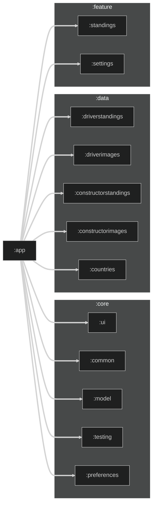

```mermaid
%%{init: {'theme':'dark'}}%%
flowchart LR
    APP[:app] ==> UI
    APP ==> COMMON
    APP ==> MODEL
    APP ==> TESTING
    APP ==> PREFERENCES
    APP ==> DRIVER_STANDINGS
    APP ==> DRIVER_IMAGES
    APP ==> CONSTRUCTOR_STANDINGS
    APP ==> CONSTRUCTOR_IMAGES
    APP ==> COUNTRIES
    APP ==> STANDINGS
    APP ==> SETTINGS
    subgraph :core
        direction LR
        MODEL[:model]
        TESTING[:testing]
        UI[:ui]
        COMMON[:common]
        PREFERENCES[:preferences]
    end
    subgraph :data
        DRIVER_STANDINGS[:driverstandings]
        DRIVER_IMAGES[:driverimages]
        CONSTRUCTOR_STANDINGS[:constructorstandings]
        CONSTRUCTOR_IMAGES[:constructorimages]
        COUNTRIES[:countries]
    end
    subgraph :feature
        STANDINGS[:standings]
        SETTINGS[:settings]
    end
```
