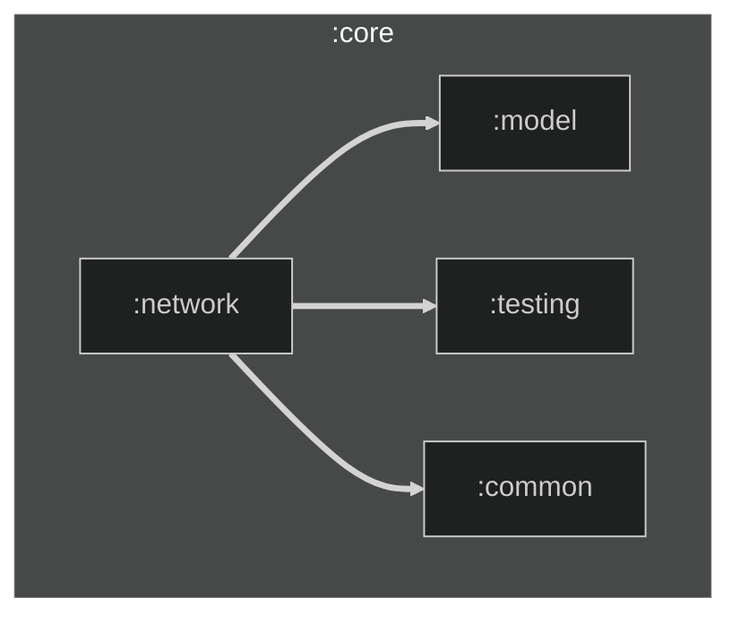

```mermaid
%%{init: {'theme':'dark'}}%%
flowchart LR
    NETWORK ==> MODEL
    NETWORK ==> TESTING
    NETWORK ==> COMMON
    subgraph :core
        direction LR
        MODEL[:model]
        TESTING[:testing]
        COMMON[:common]
        NETWORK[:network]
    end
```
