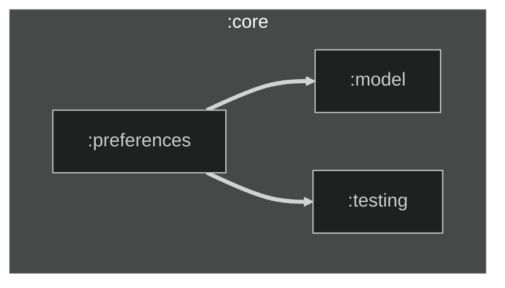

```mermaid
%%{init: {'theme':'dark'}}%%
flowchart LR
    PREFERENCES ==> MODEL
    PREFERENCES ==> TESTING
    subgraph :core
        direction LR
        MODEL[:model]
        TESTING[:testing]
        PREFERENCES[:preferences]
    end
```
