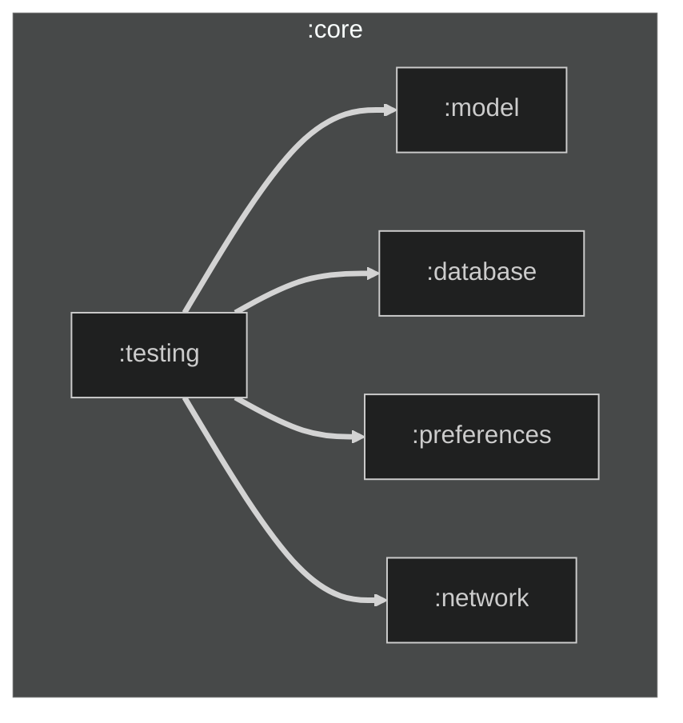

```mermaid
%%{init: {'theme':'dark'}}%%
flowchart LR
    TESTING ==> MODEL
    TESTING ==> DATABASE
    TESTING ==> PREFERENCES
    TESTING ==> NETWORK
    subgraph :core
        direction LR
        MODEL[:model]
        DATABASE[:database]
        PREFERENCES[:preferences]
        NETWORK[:network]
        TESTING[:testing]
    end
```
