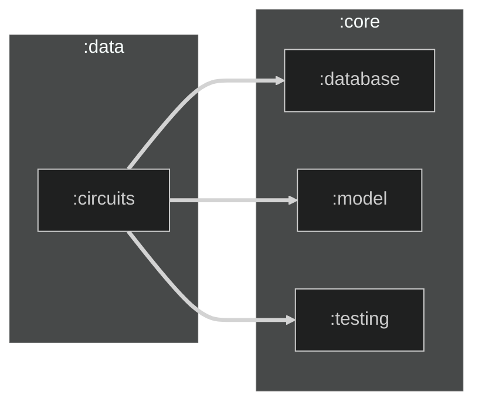

```mermaid
%%{init: {'theme':'dark'}}%%
flowchart LR
    CIRCUITS ==> DATABASE
    CIRCUITS ==> MODEL
    CIRCUITS ==> TESTING
    subgraph :core
        direction LR
        MODEL[:model]
        TESTING[:testing]
        DATABASE[:database]
    end
    subgraph :data
        CIRCUITS[:circuits]
    end
```
