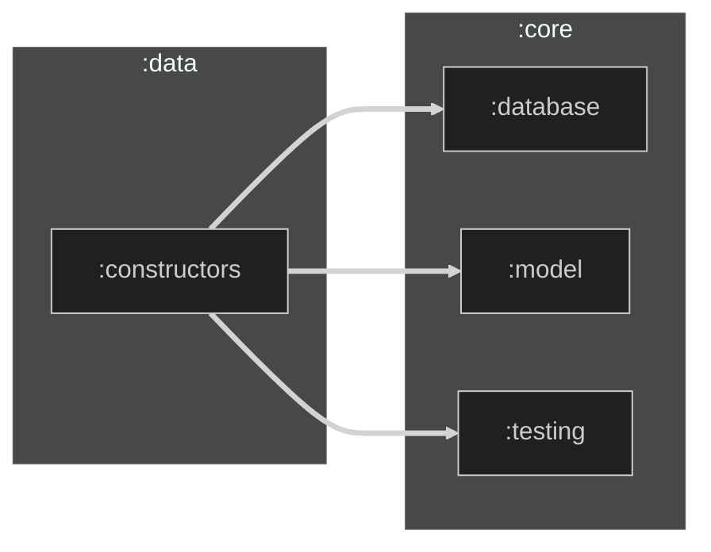

```mermaid
%%{init: {'theme':'dark'}}%%
flowchart LR
    CONSTRUCTORS ==> DATABASE
    CONSTRUCTORS ==> MODEL
    CONSTRUCTORS ==> TESTING
    subgraph :core
        direction LR
        MODEL[:model]
        TESTING[:testing]
        DATABASE[:database]
    end
    subgraph :data
        CONSTRUCTORS[:constructors]
    end
```
