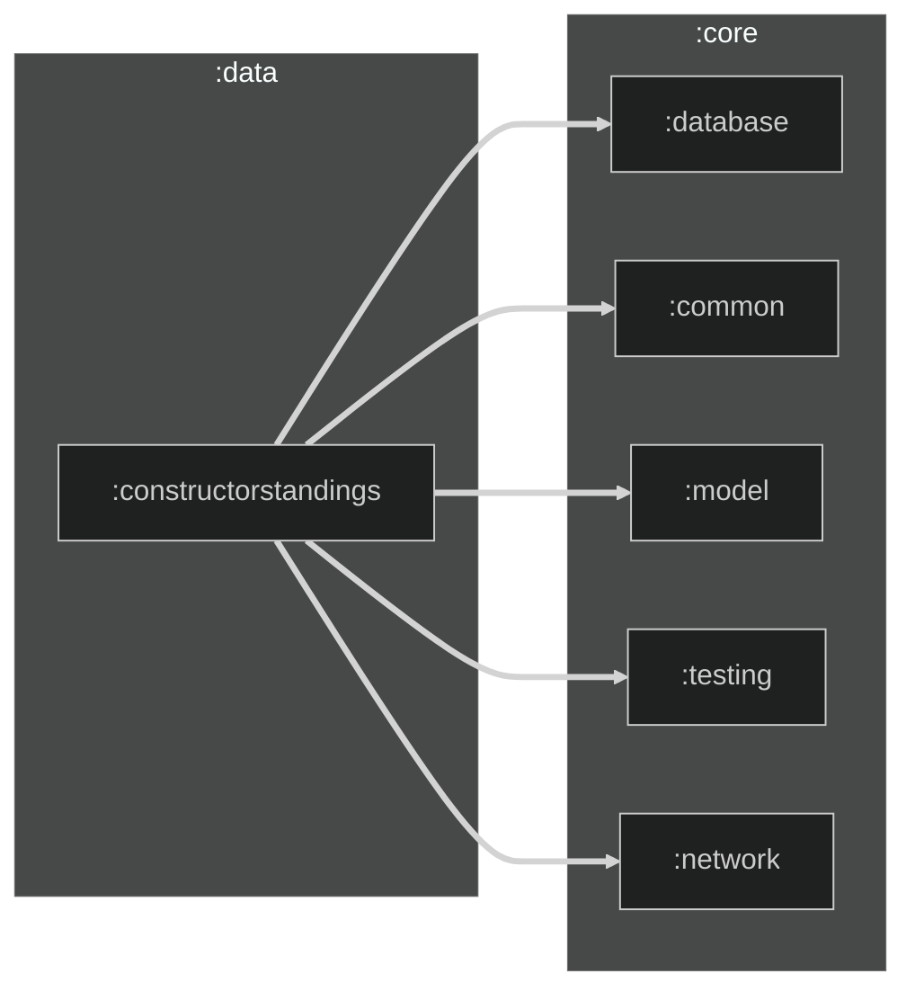

```mermaid
%%{init: {'theme':'dark'}}%%
flowchart LR
    CONSTRUCTOR_STANDINGS ==> DATABASE
    CONSTRUCTOR_STANDINGS ==> COMMON
    CONSTRUCTOR_STANDINGS ==> MODEL
    CONSTRUCTOR_STANDINGS ==> TESTING
    CONSTRUCTOR_STANDINGS ==> NETWORK
    subgraph :core
        direction LR
        MODEL[:model]
        TESTING[:testing]
        DATABASE[:database]
        COMMON[:common]
        NETWORK[:network]
    end
    subgraph :data
        CONSTRUCTOR_STANDINGS[:constructorstandings]
    end
```
