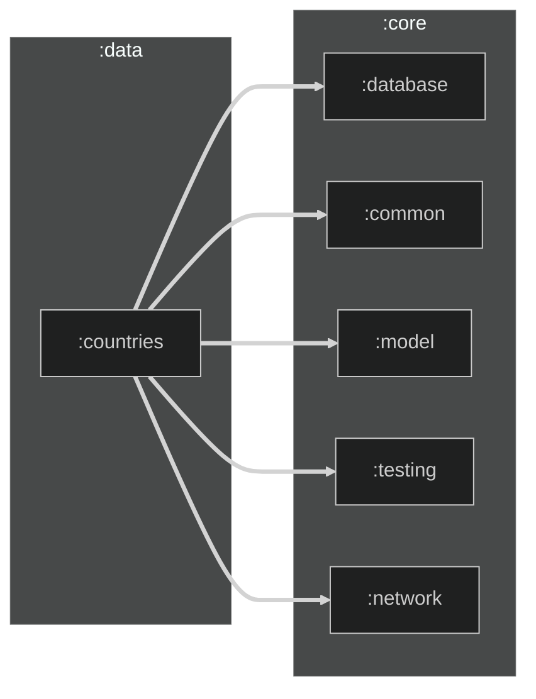

```mermaid
%%{init: {'theme':'dark'}}%%
flowchart LR
    COUNTRIES ==> DATABASE
    COUNTRIES ==> COMMON
    COUNTRIES ==> MODEL
    COUNTRIES ==> TESTING
    COUNTRIES ==> NETWORK
    subgraph :core
        direction LR
        MODEL[:model]
        TESTING[:testing]
        DATABASE[:database]
        COMMON[:common]
        NETWORK[:network]
    end
    subgraph :data
        COUNTRIES[:countries]
    end
```
