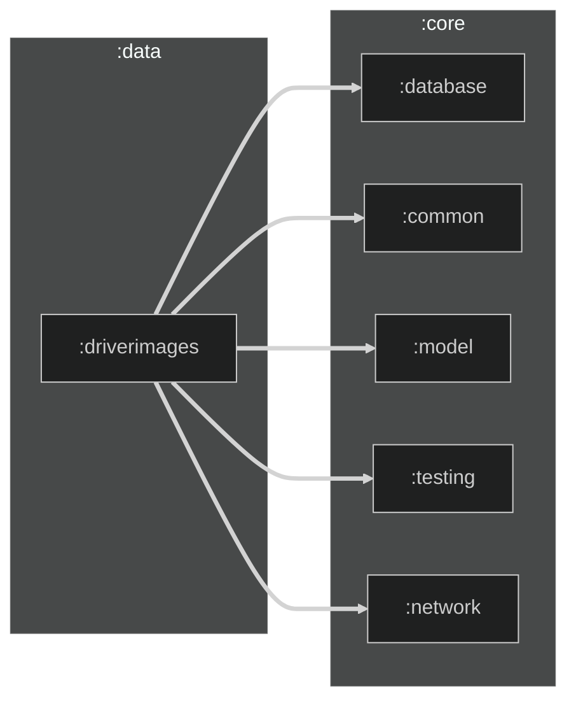

```mermaid
%%{init: {'theme':'dark'}}%%
flowchart LR
    DRIVER_IMAGES ==> DATABASE
    DRIVER_IMAGES ==> COMMON
    DRIVER_IMAGES ==> MODEL
    DRIVER_IMAGES ==> TESTING
    DRIVER_IMAGES ==> NETWORK
    subgraph :core
        direction LR
        MODEL[:model]
        TESTING[:testing]
        DATABASE[:database]
        COMMON[:common]
        NETWORK[:network]
    end
    subgraph :data
        DRIVER_IMAGES[:driverimages]
    end
```
