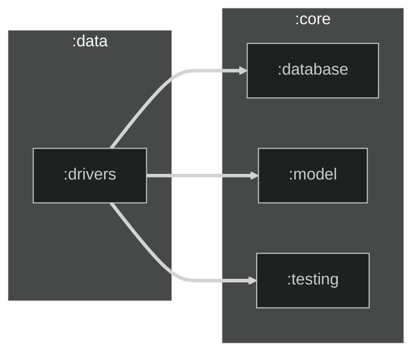

```mermaid
%%{init: {'theme':'dark'}}%%
flowchart LR
    DRIVERS ==> DATABASE
    DRIVERS ==> MODEL
    DRIVERS ==> TESTING
    subgraph :core
        direction LR
        MODEL[:model]
        TESTING[:testing]
        DATABASE[:database]
    end
    subgraph :data
        DRIVERS[:drivers]
    end
```
