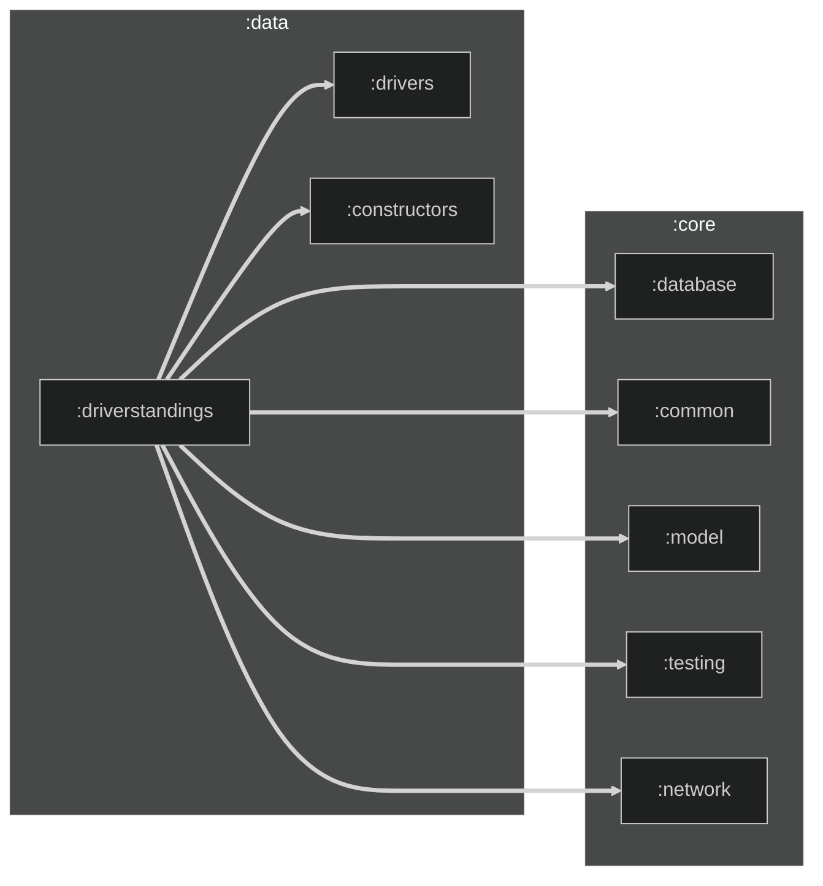

```mermaid
%%{init: {'theme':'dark'}}%%
flowchart LR
    DRIVER_STANDINGS ===> DATABASE
    DRIVER_STANDINGS ==> COMMON
    DRIVER_STANDINGS ==> MODEL
    DRIVER_STANDINGS ==> TESTING
    DRIVER_STANDINGS ==> NETWORK
    DRIVER_STANDINGS ==> DRIVERS
    DRIVER_STANDINGS ==> CONSTRUCTORS
    subgraph :core
        direction LR
        MODEL[:model]
        TESTING[:testing]
        DATABASE[:database]
        COMMON[:common]
        NETWORK[:network]
    end
    subgraph :data
        DRIVER_STANDINGS[:driverstandings]
        DRIVERS[:drivers]
        CONSTRUCTORS[:constructors]
    end
```
