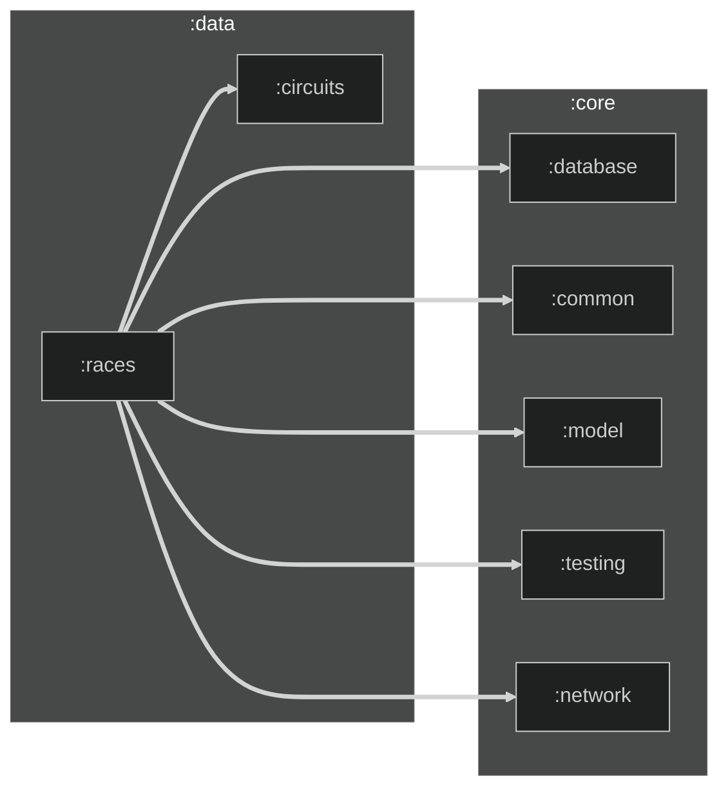

```mermaid
%%{init: {'theme':'dark'}}%%
flowchart LR
    RACES ===> DATABASE
    RACES ==> COMMON
    RACES ==> MODEL
    RACES ==> TESTING
    RACES ==> NETWORK
    RACES ==> CIRCUITS
    subgraph :core
        direction LR
        MODEL[:model]
        TESTING[:testing]
        DATABASE[:database]
        COMMON[:common]
        NETWORK[:network]
    end
    subgraph :data
        RACES[:races]
        CIRCUITS[:circuits]
    end
```
