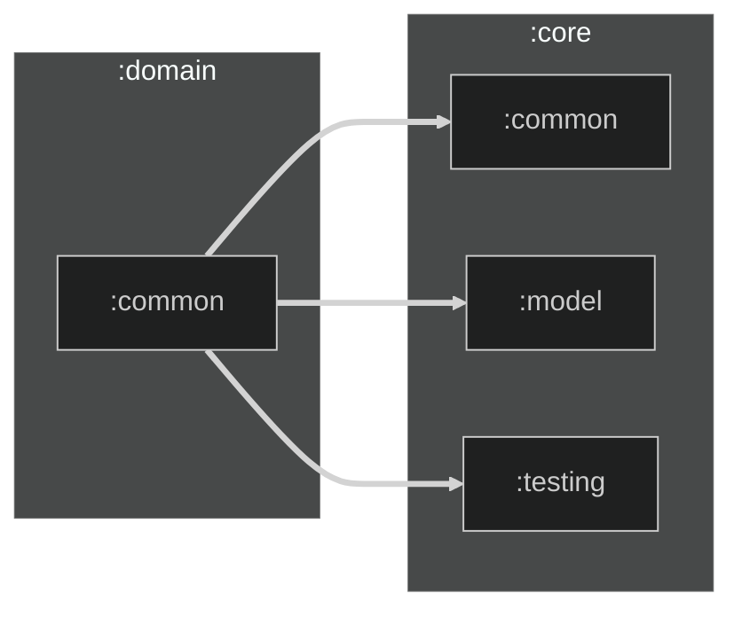

```mermaid
%%{init: {'theme':'dark'}}%%
flowchart LR
    DOMAIN_COMMON ==> COMMON
    DOMAIN_COMMON ==> MODEL
    DOMAIN_COMMON ==> TESTING
    subgraph :core
        direction LR
        MODEL[:model]
        TESTING[:testing]
        COMMON[:common]
    end
    subgraph :domain
        DOMAIN_COMMON[:common]
    end
```
