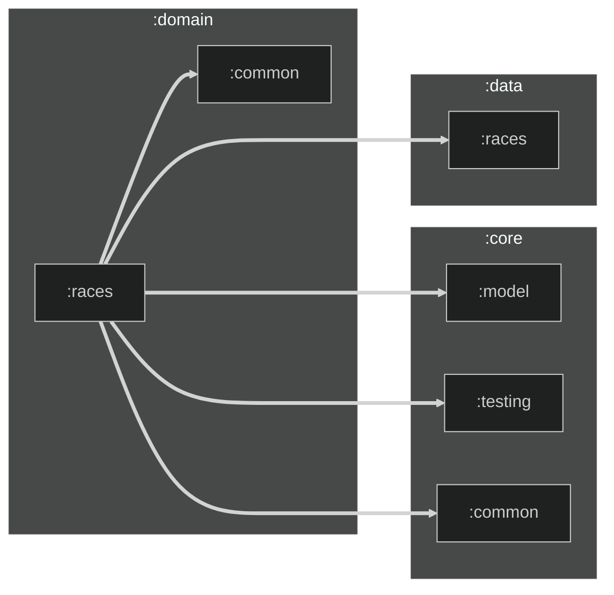

```mermaid
%%{init: {'theme':'dark'}}%%
flowchart LR
    RACES ==> DOMAIN_COMMON
    RACES ===> MODEL
    RACES ==> TESTING
    RACES ==> COMMON
    RACES ===> DATA_RACES
    subgraph :core
        direction LR
        MODEL[:model]
        TESTING[:testing]
        COMMON[:common]
    end
    subgraph :data
        direction LR
        DATA_RACES[:races]
    end
    subgraph :domain
        DOMAIN_COMMON[:common]
        RACES[:races]
    end
```
