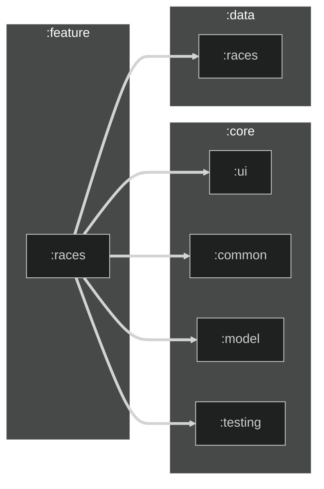

```mermaid
%%{init: {'theme':'dark'}}%%
flowchart LR
    RACES ==> UI
    RACES ==> COMMON
    RACES ==> MODEL
    RACES ==> TESTING
    RACES ==> RACES_DATA
    subgraph :core
        direction LR
        MODEL[:model]
        TESTING[:testing]
        UI[:ui]
        COMMON[:common]
    end
    subgraph :data
        RACES_DATA[:races]
    end
    subgraph :feature
        RACES[:races]
    end
```
