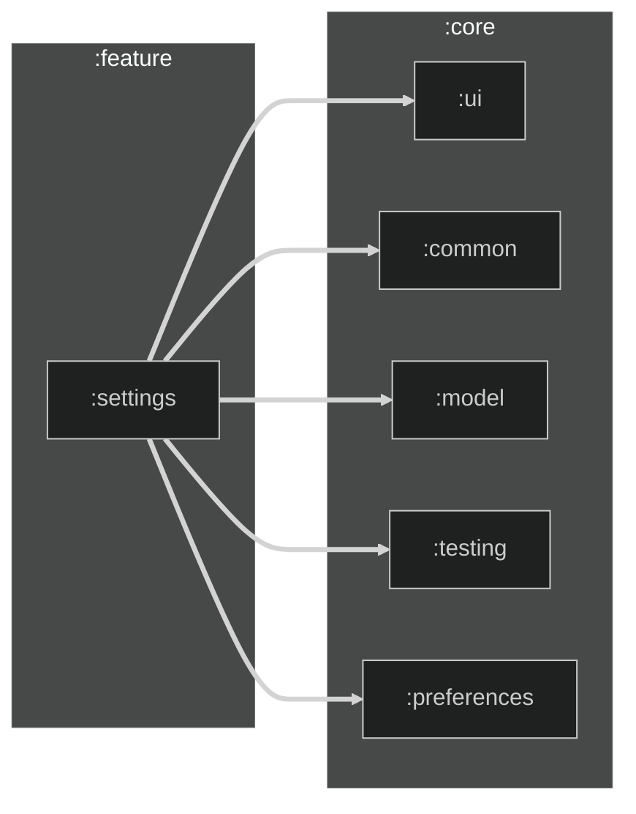

```mermaid
%%{init: {'theme':'dark'}}%%
flowchart LR
    SETTINGS ==> UI
    SETTINGS ==> COMMON
    SETTINGS ==> MODEL
    SETTINGS ==> TESTING
    SETTINGS ==> PREFERENCES
    subgraph :core
        direction LR
        MODEL[:model]
        TESTING[:testing]
        UI[:ui]
        COMMON[:common]
        PREFERENCES[:preferences]
    end
    subgraph :feature
        SETTINGS[:settings]
    end
```
