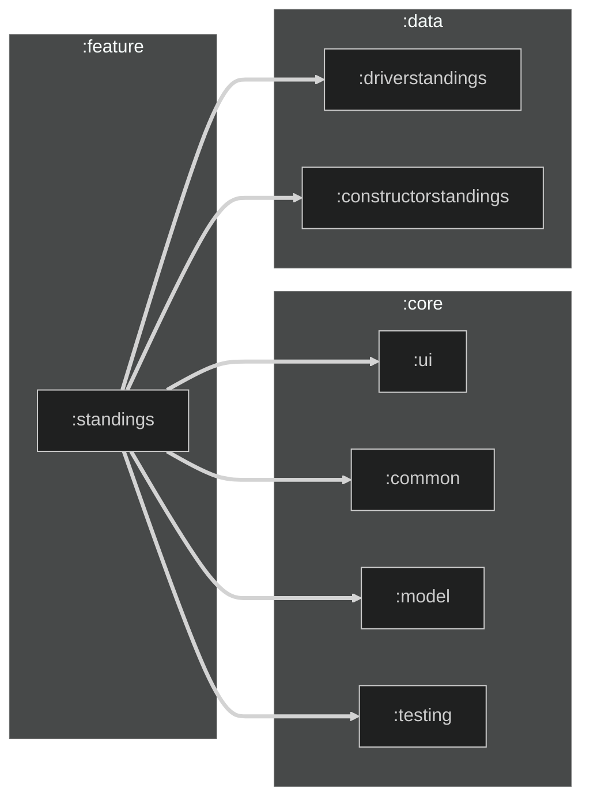

```mermaid
%%{init: {'theme':'dark'}}%%
flowchart LR
    STANDINGS ==> UI
    STANDINGS ==> COMMON
    STANDINGS ==> MODEL
    STANDINGS ==> TESTING
    STANDINGS ==> DRIVER_STANDINGS
    STANDINGS ==> CONSTRUCTOR_STANDINGS
    subgraph :core
        direction LR
        MODEL[:model]
        TESTING[:testing]
        UI[:ui]
        COMMON[:common]
    end
    subgraph :data
        DRIVER_STANDINGS[:driverstandings]
        CONSTRUCTOR_STANDINGS[:constructorstandings]
    end
    subgraph :feature
        STANDINGS[:standings]
    end
```
